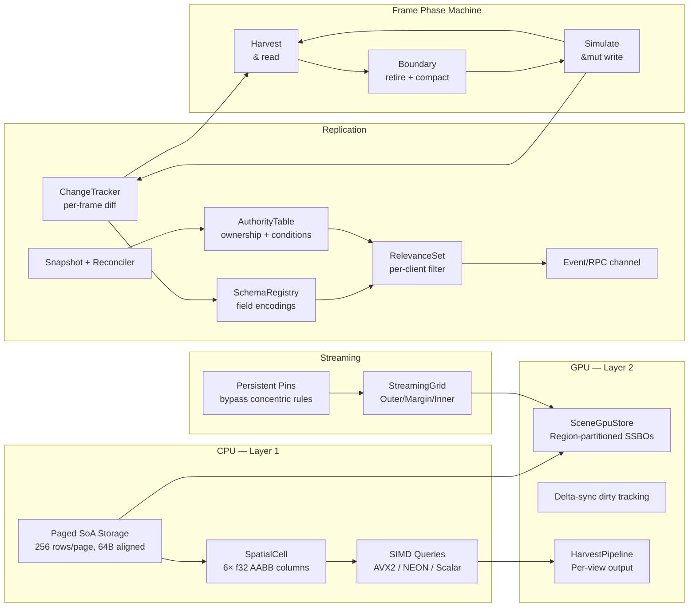
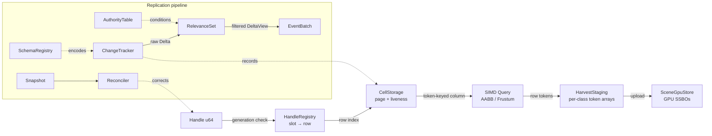

<p align="center">
  
</p>

# SceneDB

GPU-native ECS and spatial database for game engines, built in Rust.

SceneDB is what you get when you decide your entity storage should be a database, not a bag of loose objects. Everything lives in cache-friendly SoA pages on the CPU side — paged storage, spatial bounds, SIMD queries, the streaming grid, and the phase machine all run on the CPU. Only the GPU-mirrored fields (transform columns, instance info, generation buffers, slot mirrors) use delta-sync — the CPU-side fields like bounds columns stay on the CPU and never touch VRAM, and handles are stable u64s with generation counters so compaction never leaves you with a dangling pointer. SIMD spatial queries (AVX2, NEON), a streaming grid that decides what's resident based on where players are standing, persistent region pinning, and a compile-time frame phase machine that makes invalid state transitions unrepresentable.

SceneDB also provides a complete replication primitive suite — change tracking, delta encoding, interest management, authority, events/RPCs, snapshots, and client-side prediction reconciliation — so multiplayer and multi-user-editor support is built into the data layer rather than bolted on as an afterthought.



## Architecture

SceneDB is layered. The bottom is a paged storage engine: fixed-capacity SoA pages (256 rows default, 1024 max) with 64-byte aligned columns and a 128-byte per-element stride ceiling. Each row gets a `Handle` — a packed u64 with a slot index, generation counter, and type tag. Swap-and-pop compaction at frame boundaries rearranges physical rows without breaking handles.

The spatial layer wraps a page with six dedicated f32 columns for AABB min/max per axis. Queries scan directly over the column arrays — no per-entity iteration, no allocation in the hot path. The SIMD layer accelerates these with AVX2 (x86) and NEON (ARM), plus a scalar reference implementation that the vectorized paths must match bit-for-bit. Both AABB and frustum queries are supported.

The streaming grid classifies cells into Outer, Margin, or Inner domains using a concentric distance model with hysteresis bands that damp boundary jitter. You pass a slice of observer AABBs, so multiple players with overlapping load areas work correctly — a cell promotes if any player is close enough and demotes only when all players have left. Cells can also be pinned to any domain directly, bypassing the distance-based rules entirely. Both modes coexist on the same grid.

On the GPU side, a `SceneGpuStore` manages region-partitioned SSBOs shared across every registered cell. Delta-sync uploads only the rows that changed since the last sync. A generation buffer and slot mirror live in VRAM for GPU-side handle validation, with bulk rebuild for device loss recovery. The harvest pipeline runs per-view spatial queries (one staging array per view, no shared state) and routes hits into mesh-class buckets for indirect draw dispatch.

A compile-time frame phase machine enforces the ordering: you hold a `SimulateWitness` to write, a `HarvestPhase` to read back, and a `RetiredPhase` to compact. Pass the wrong witness to a function and it won't compile. No runtime checks, no phase-order bugs.

On top of the storage and phase machine, the **replication layer** provides the primitives needed for server-authoritative multiplayer and multi-user-editor sessions. It records every mutation during Simulate (change tracking), encodes field deltas per a component schema (delta encoding), filters which client sees what (interest management + conditions), resolves who is allowed to write what (authority table), handles one-shot RPCs (event channel), and supports client-side prediction with server reconciliation (snapshots + reconciler). All primitives are graphics-free (C0) and work with `--no-default-features`.



## Usage

### Spatial cell

Create a spatial cell, spawn elements with bounding boxes, and query.

```rust
use pulsar_scenedb::{SpatialCell, Aabb, Handle};

let mut cell = SpatialCell::new(256).unwrap();

let handle: Handle = cell.alloc(Aabb {
    min: [0.0, 0.0, 0.0],
    max: [1.0, 1.0, 1.0],
}).unwrap();

let mut results = vec![0u32; cell.rows_in_use() as usize];
let hit_count = cell.query_aabb(
    &Aabb { min: [-1.0; 3], max: [2.0; 3] },
    &mut results,
);
// results[0] == 0 (the handle's row passed the query)
```

### Streaming grid

Set up a streaming grid and let it classify cells against players.

```rust
use pulsar_scenedb::gpu::grid::{StreamingGrid, GridConfig, CellCoord, Domain, StreamingBudget};

let mut grid = StreamingGrid::new(
    GridConfig {
        cell_width: 100.0,
        margin_radius: 150.0,
        pad_fraction: 0.10,
        hysteresis: 20.0,
    },
    StreamingBudget {
        vram_hlod_budget: 256_000_000,
        vram_geometry_budget: 1_000_000_000,
        max_materialized_cells: 1024,
        proxy_mesh_bytes: 4096,
        mean_cell_geometry_bytes: 1_048_576,
    },
    &[], // inner region classes
).unwrap();

grid.materialize(CellCoord { x: 0, z: 0 });

// Two players at different positions — overlapping load areas.
grid.classify(&[
    Aabb { min: [-10.0, -10.0, -10.0], max: [10.0, 10.0, 10.0] },
    Aabb { min: [490.0, -10.0, -10.0], max: [510.0, 10.0, 10.0] },
]);

let transitions = grid.take_transitions();
// Cells near either player will promote.
```

Pin a cell to keep it loaded regardless of where players are.

```rust
grid.pin(CellCoord { x: 5, z: 3 }, Domain::Inner);
// This cell stays Inner even if every player is on the other side of the map.
grid.unpin(CellCoord { x: 5, z: 3 });
// Back to concentric rules.
```

---

## Macro system

SceneDB provides a suite of derive macros that generate Pod implementations, GPU column dispatch, and replication schema declarations — turning plain structs into fully wired engine components with zero boilerplate.

### `#[derive(SceneStore)]` — Pod + GPU dispatch + storage location

The workhorse macro defined in `pulsar_scenedb_derive`. Generates a `Pod` impl, `SceneColumnSet` (column layout), `GpuColumnSet` (GPU write dispatch), and `MirrorMode` wiring. Every field must itself implement SceneDB's narrow `Pod` trait, and the resulting type must be `Copy`. A field marked `#[gpu]` additionally must implement bytemuck's `Pod + Zeroable`: differential World dispatch compares the exact shader-row bytes, so implicit/uninitialized padding is rejected at compile time rather than spuriously dirtying a row or invoking undefined behavior. Packed layouts also assert that the generated row size equals the sum of its fields; represent shader padding with explicit `#[gpu]` padding fields. The built-in fixed-size array implementation is `[f32; 16]`; `[f32; 2/3/4]`, `[u8; N]`, and arbitrary arrays are not SceneDB `Pod` merely because their elements are. Use scalar fields, `[f32; 16]`, or a reviewed local newtype with an explicit `unsafe impl Pod` whose all-zero representation is valid. `repr(C)` is strongly recommended for any type whose bytes cross an FFI/GPU boundary; the derive does not prove an arbitrary CPU-only struct has no padding.

```rust
use pulsar_scenedb_derive::SceneStore;

#[derive(SceneStore, Clone, Copy)]
#[repr(C)]
pub struct Transform {
    pub matrix: [f32; 16],
}
```

This expands to:

- `unsafe impl Pod for Transform` — enables direct column memcpy
- `impl SceneColumnSet for Transform` — column descriptors for `CellType`
- `impl GpuColumnSet for Transform` — GPU column descriptors + `write_gpu` dispatch

#### Per-field storage location with `#[gpu(mirror = ...)]`

Every field lives in CPU SoA columns by default. Adding `#[gpu]` creates an additional GPU-side mirror (SSBO column in `SceneGpuStore`). The `#[derive(SceneStore)]` macro only looks for `#[gpu]` attributes — any other attribute (`#[replicate]`, `#[serde]`, etc.) passes through unmodified.

| Attribute | CPU column | GPU mirror | Sync mode | Use case |
|---|---|---|---|---|
| *(none)* | Yes | No | — | Bounds, metadata, editor-only data |
| `#[gpu]` | Yes | Yes | `DirtyTracked` | Per-frame transforms, instance data |
| `#[gpu(mirror = DirtyTracked)]` | Yes | Yes | Per-frame dirty tracking | Explicit form of bare `#[gpu]` |
| `#[gpu(mirror = Once)]` | Yes | Yes | Upload once, never re-sync | Static geometry, constant buffers |
| `#[gpu(buffer = "general_mesh_buf")]` | Yes | Yes | `DirtyTracked` + stable named destination | Sharing one compatible renderer buffer across component paths |

The options compose in either order: for example, `#[gpu(mirror = Once, buffer = "general_mesh_buf")]`. Bare `#[gpu]` defaults to `DirtyTracked`. The underlying `MirrorMode` enum (`pulsar_scenedb::gpu::MirrorMode`) has two variants — `DirtyTracked` and `Once`.

Fields **without** `#[gpu]` stay CPU-only — they consume no VRAM, generate no dirty words in `SceneGpuStore`, and never participate in delta-sync. They DO participate in replication (via `#[replicate]`), spatial queries, and everything else on the CPU side.

`buffer = "..."` is an identity, not merely a debug label. The derive emits
it as `GpuColumnDesc::buffer_key` together with the raw field type's
`value_token`; registration maps each component-local wrapper column to the
same canonical GPU allocation when an explicit key is reused through fixed
CellStorage. That path is safe because cells occupy disjoint physical row
regions. Reuse is accepted only when row type/layout/stride, mirror mode, and
residency mode are compatible; an incompatible registration is rejected
instead of silently replacing an existing buffer. Growable World registration
is stricter: one canonical buffer has exactly one owning component type,
because two components on the same entity would otherwise race with silent
last-write-wins semantics at the same row. Give those World components
distinct keys or consolidate the shader row into one component. A bare
`#[gpu]` has no global key —
its `buffer_name` remains useful display/reflection metadata, but common Rust
field names such as `value` or `position` never alias by accident.

Within one non-packed type, explicit keys must be unique. Explicit per-field
keys are currently rejected on `#[gpu(layout = packed)]` types because that
World path registers one interleaved physical row, not one buffer per named
field; a future packed/group key needs metadata for that actual combined
layout rather than pretending a field key names it.

Generic CPU-only `SceneStore` structs remain supported, subject to the normal
`Pod + 'static` bounds for stored field types. A generic struct with any
`#[gpu]` field is a compile error: the link-time World inventory and GPU
partner registry require one concrete component identity, and SceneDB does
not yet expose explicit registration per monomorph. Use a concrete wrapper
for GPU-mirrored data rather than letting multiple monomorphs share an
ambiguous generated wrapper/registration.

```rust
use pulsar_scenedb_derive::SceneStore;

/// A material component with mixed storage locations:
///   - color, roughness, metallic → CPU + GPU (dirty-tracked mirror)
///   - name → CPU only (no GPU mirror, no VRAM cost)
#[derive(SceneStore, Clone, Copy)]
#[repr(C)]
pub struct Material {
    #[gpu]                              // CPU + GPU, DirtyTracked
    pub albedo_rgba8: u32,

    #[gpu(mirror = DirtyTracked)]        // CPU + GPU, explicit
    pub roughness: f32,

    #[gpu]                              // CPU + GPU, DirtyTracked
    pub metallic: f32,

    // No #[gpu] — CPU only. No VRAM, no dirty tracking.
    pub name_hash: u64,
}
```

#### Registering GPU columns at store construction

`#[gpu]`-marked fields don't get a GPU buffer for free just by being written —
each one needs a call to `register_gpu_buffer` before `write_gpu` has anywhere
to sync to. The derive generates that call for you as
`YourType::register_gpu_columns(&mut store, capacity, device)`; invoke it once
per `#[derive(SceneStore)]` type, at `SceneGpuStore` construction time, with
the same row `capacity` every other column on the store uses:

```rust
let mut store = SceneGpuStore::new(&ctx, scene_cfg());
Material::register_gpu_columns(&mut store, row_capacity, ctx.device());
StaticMeshInstance::register_gpu_columns(&mut store, row_capacity, ctx.device());
```

Skip it and `write_gpu` still "succeeds" — `mark_column_dirty` silently
no-ops when it can't find a matching buffer, so the data just never reaches
VRAM, with no error telling you why. This isn't a footgun you can trigger by
forgetting a step correctly, though: each `#[gpu]` field is backed by its own
generated, uniquely-typed column internally, so registering the wrong
type isn't representable — either you call the type's own
`register_gpu_columns` or you don't.

That per-field uniqueness is also what makes same-shaped fields safe across
(and *within*) types — `StaticMeshInstance` below has two `#[gpu(mirror =
Once)] u32` fields, and `Material` above has three `#[gpu]` fields of
overlapping shapes; none of them alias each other's GPU buffer, because each
field's column identity is keyed by (struct, field), not by the field's raw
type alone.

#### GPU-native fields with `#[gpu(mirror = Once)]`

For data that never changes after initial upload:

```rust
#[derive(SceneStore)]
#[repr(C)]
pub struct StaticMeshInstance {
    #[gpu(mirror = Once)]    // uploaded once, never re-synced
    pub mesh_id: u32,

    #[gpu(mirror = Once)]    // uploaded once, never re-synced
    pub material_id: u32,

    #[gpu]                   // per-frame dirty tracked
    pub transform: [f32; 16],
}
```

#### Packed layout with `#[gpu(layout = packed)]`

By default every `#[gpu]` field gets its own buffer — the right shape for genuinely independent fields (two components' unrelated `f32`s never share storage just because they're the same size). Some structs are the opposite case: a renderer's per-instance GPU record, where every `#[gpu]` field is always read together, by one shader, as one interleaved struct — exactly the shape of Helio's `GpuInstanceData` (model matrix, normal matrix, bounds, previous-frame matrix, mesh/material ids, flags — always bound and read as a single 208-byte record, never independently). Splitting that into 8 separate buffers has no benefit and forces a shader rewrite for no reason. `#[gpu(layout = packed)]` on the struct groups every `#[gpu]` field into one buffer instead:

```rust
#[derive(SceneStore, Clone, Copy)]
#[gpu(layout = packed)]
pub struct InstanceComponent {
    #[gpu]
    pub model: [f32; 16],
    #[gpu]
    pub mesh_id: u32,
    #[gpu]
    pub material_id: u32,
    #[gpu]
    pub flags: u32,
    pub local_lod_bias: f32, // no #[gpu] -- stays CPU-only, excluded from the packed buffer
}

InstanceComponent::register_gpu_columns_growable(&mut store, 1024, &device);
world.attach_gpu_mirror(GpuMirrorHandle::new(Arc::clone(&store), Arc::clone(&queue)));
world.insert(entity, InstanceComponent { model, mesh_id, material_id, flags, local_lod_bias: 0.0 });
// -> one write, one buffer, one interleaved record per row, assembled by
//    field access (safe -- InstanceComponent's own field order isn't
//    forced to match the packed record's, since it's built fresh from
//    named field reads, not a raw byte-range copy).

// The packed buffer's underlying type is intentionally unnameable (same
// reasoning as the per-field #[gpu] wrapper types) -- reach it by
// ComponentId instead:
let id = InstanceComponent::packed_gpu_component_id();
store.with_dirty_tracked_buffer_for_id(id, &mut |buf| {
    // bind `buf` into a bind group, exactly like any other wgpu::Buffer
});
```

Scoped deliberately to the World-mirror path only: `gpu_columns()`, `write_gpu` (the `CellStorage`/`Handle` path), and the fixed (non-growable) `register_gpu_columns` are completely unaffected by this attribute — they stay per-field regardless, because the cell-mirrored boundary sync reads from `CellStorage`'s own per-field SoA columns, which packing has no relationship to. Only `register_gpu_columns_growable` and `World::insert`'s automatic dispatch route through the packed buffer. If you need a packed layout for the cell-mirrored path too, hand-write a `GpuColumnSet` treating the whole struct as one column (the pattern `tests/gpu_generic_column.rs` proves) — the derive doesn't generate that for you today.

#### Fully CPU-only component

Omit `#[gpu]` entirely:

```rust
/// No VRAM usage, no delta-sync. Still replicated via #[replicate].
#[derive(SceneStore)]
#[repr(C)]
pub struct AiState {
    pub current_behaviour: u32,
    pub target_entity: u64,
    pub alertness: f32,
    pub path_length: u32,
}
```

### Combining `#[gpu]` and `#[replicate]` on the same field

`#[derive(SceneStore)]` only processes `#[gpu(...)]` attributes; `#[derive(Replicate)]` only processes `#[replicate(...)]` attributes. They're independent derives that coexist on the same struct (and even the same field) because each only looks at its own attributes — stack both:

```rust
use pulsar_scenedb_derive::{SceneStore, Replicate};
use pulsar_scenedb::ReplicationEncoding::*;
use pulsar_scenedb::ReplicationCondition::*;

/// A mesh instance that is both GPU-native AND replicated over the network.
/// SceneStore generates Pod + GPU dispatch for the #[gpu] fields; Replicate
/// generates `register_replication` from the #[replicate] fields. `Default`
/// is required by `Replicate` — it's how a freshly-spawned entity gets a
/// placeholder row before its real field values arrive over the wire.
#[derive(SceneStore, Replicate, Default)]
#[repr(C)]
pub struct MeshInstance {
    /// GPU-mirrored (dirty-tracked every frame) AND network-replicated as a
    /// GPU handle (only the 8-byte handle index travels, not the vertex data).
    #[gpu]
    #[replicate(encoding = GpuHandle, condition = Always)]
    pub mesh: Handle<Mesh>,

    /// GPU-mirrored (uploaded once) AND network-replicated only at spawn.
    #[gpu(mirror = Once)]
    #[replicate(encoding = Pod, condition = InitialOnly)]
    pub base_transform: [f32; 16],

    /// CPU only (no GPU mirror) AND replicated to simulated proxies.
    #[replicate(encoding = DeltaCompressed, condition = SimulatedOnly)]
    pub health: f32,
}
```

Every `#[replicate(...)]` field's type must implement `Replicable` (see below) — every `Pod` type already does via a blanket impl, which covers all three fields above (`Handle<Mesh>`, `[f32; 16]`, and `f32` are all Pod).

The `#[gpu]` and `#[replicate]` attributes are orthogonal:

| Storage (via `#[gpu]`) | Replication (via `#[replicate]`) | Result |
|---|---|---|
| *(none)* | *(none)* | CPU-only, never replicated |
| *(none)* | `GpuHandle` | CPU-only on server, handle sent over wire, remote resolves locally |
| `#[gpu]` | *(none)* | GPU mirror, never replicated |
| `#[gpu]` | `Always` | GPU mirror + network-replicated every frame |
| `#[gpu(mirror = Once)]` | `InitialOnly` | GPU mirror (once) + network-replicated once at spawn |

### `#[replicate(...)]` — Replication schema on fields

Field-level attributes that declare replication behaviour, processed by `#[derive(Replicate)]`. Each field gets an encoding mode and a replication condition; the derive turns them into a real per-named-field accessor (not just bookkeeping) registered with `ReplicationRegistry` to build the per-component-type schema that drives delta encoding and interest management. Every annotated field's type must implement `Replicable`; the struct itself must implement `Default` (used to fill a placeholder row when an entity is spawned before its real values arrive). A field with no `#[replicate(...)]` attribute is simply not replicated.

```rust
use pulsar_scenedb_derive::Replicate;
use pulsar_scenedb::ReplicationEncoding::{self, *};
use pulsar_scenedb::ReplicationCondition::{self, *};

/// A player state component with per-field replication control.
#[derive(Replicate, Default)]
struct PlayerState {
    /// Full transform: replicated every frame to everyone as raw Pod bytes.
    #[replicate(encoding = Pod, condition = Always)]
    position: [f32; 3],

    /// Health: only sent to non-owning simulated proxies, delta-compressed.
    #[replicate(encoding = DeltaCompressed, condition = SimulatedOnly)]
    health: f32,

    /// Ammo: only relevant to the owning client.
    #[replicate(encoding = Pod, condition = AutonomousOnly)]
    ammo: u32,

    /// Inventory: sent once at spawn, never again. `Vec<Item>` needs
    /// `Item: Replicable` — implement it by hand for your own types (see
    /// `Replicable`'s doc), or use a `Vec` of anything already `Replicable`.
    #[replicate(encoding = Serialized, condition = InitialOnly)]
    inventory: Vec<Item>,

    /// GPU resource handle: only the 8-byte index travels, not the mesh data.
    #[replicate(encoding = GpuHandle, condition = Always)]
    mesh: Handle<Mesh>,

    /// One-shot event: never in state deltas, delivered via RPC channel.
    /// Event fields don't need `Replicable` — they're never stored in a
    /// column, only queued and flushed through the RPC channel.
    #[replicate(encoding = Event, condition = Multicast)]
    on_damage_taken: DamageEvent,
}

let mut registry = ReplicationRegistry::new();
PlayerState::register_replication(&mut registry);
```

### Combined: full component definition

A component can use `SceneStore` and `Replicate` together — the macros compose (each only reads its own attributes):

```rust
use pulsar_scenedb_derive::{SceneStore, Replicate};
use pulsar_scenedb::ReplicationEncoding::*;
use pulsar_scenedb::ReplicationCondition::*;

/// A fully wired engine component: SceneStore generates Pod + GPU dispatch,
/// Replicate generates the replication schema for the delta encoder.
#[derive(SceneStore, Replicate, Default)]
#[repr(C)]
struct Character {
    /// Server-authoritative position, plain memcpy on the wire.
    #[replicate(encoding = Pod, condition = ServerAuthority)]
    position: [f32; 3],

    /// Owned by the client that controls this character.
    /// The server validates bounds and re-broadcasts.
    #[replicate(encoding = Pod, condition = ClientAuthority)]
    look_direction: [f32; 2],

    /// Only sent to simulated (non-owning) clients.
    #[replicate(encoding = DeltaCompressed, condition = SimulatedOnly)]
    health: f32,

    /// Always relevant, GPU handle only.
    #[replicate(encoding = GpuHandle, condition = Always)]
    skinned_mesh: Handle<SkinnedMesh>,

    /// One-shot RPC: play an animation on all clients.
    #[replicate(encoding = Event, condition = Multicast)]
    on_play_animation: AnimationEvent,
}
```

### How it works

At compile time, `#[derive(SceneStore)]` expands to:

- `unsafe impl Pod for Character` — enables direct memcpy of column data
- `impl GpuColumnSet for Character` — column descriptors and GPU write dispatch
- `const COLUMN_DESCS: &[ColumnDesc]` — column layout for `CellStorage::new`
- `fn write_gpu_columns(&self, store: &SceneGpuStore, handle: Handle, witness: &SimulateWitness)` — per-field GPU mirror writes

The `#[replicate(...)]` attributes are read by the companion `#[derive(Replicate)]` macro, which generates a `register_replication` associated function equivalent to this manual `SchemaBuilder` usage — note `field` takes real accessors to the named field, not just its name, so the encoder/decoder it builds dispatches to that one field specifically:

```rust
// Manual equivalent of what #[derive(Replicate)] generates for `Character`:
let builder = registry.register::<Character>();
registry.insert(
    builder
        .field("position", |c: &Character| &c.position, |c: &mut Character| &mut c.position, Pod, ServerAuthority)
        .field("look_direction", |c: &Character| &c.look_direction, |c: &mut Character| &mut c.look_direction, Pod, ClientAuthority)
        .field("health", |c: &Character| &c.health, |c: &mut Character| &mut c.health, DeltaCompressed, SimulatedOnly)
        .field("skinned_mesh", |c: &Character| &c.skinned_mesh, |c: &mut Character| &mut c.skinned_mesh, GpuHandle, Always)
        .event("on_play_animation", Multicast, EventChannel::ReliableOrdered)
);
```

Registering a whole component as one value (no sub-fields) is common enough to have a shortcut — `SchemaBuilder::whole_field` wraps the identity-accessor version of the pattern above:

```rust
let builder = registry.register::<Health>();
registry.insert(builder.whole_field("value", DeltaCompressed, SimulatedOnly));
```

### Pattern library

Here are the common replication patterns expressed as component definitions:

**Server-authoritative projectile:**

```rust
#[derive(SceneStore, Replicate, Default)]
#[repr(C)]
struct Projectile {
    #[replicate(encoding = Pod, condition = Always)]
    position: [f32; 3],
    #[replicate(encoding = Pod, condition = Always)]
    velocity: [f32; 3],
    #[replicate(encoding = Event, condition = Multicast)]
    on_impact: ImpactEvent,
}
```

**Client-authoritative player input:**

```rust
#[derive(SceneStore, Replicate, Default)]
#[repr(C)]
struct PlayerInput {
    #[replicate(encoding = DeltaCompressed, condition = ClientAuthority)]
    move_direction: [f32; 2],
    #[replicate(encoding = Event, condition = ClientToServer)]
    on_jump: JumpEvent,
}
```

**Editor-only metadata (multi-user):**

```rust
#[derive(SceneStore, Replicate, Default)]
#[repr(C)]
struct EditorMetadata {
    #[replicate(encoding = Pod, condition = Shared)]
    selected: u32,
    // `Vec<Property>` needs `Property: Replicable` — implement it by hand,
    // same as `PlayerState::inventory` above.
    #[replicate(encoding = Serialized, condition = Shared)]
    custom_properties: Vec<Property>,
}
```

**Visibility-gated game state:**

```rust
#[derive(SceneStore, Replicate, Default)]
#[repr(C)]
struct FactionVisibility {
    #[replicate(encoding = Pod, condition = Always)]
    world_position: [f32; 3],
    #[replicate(encoding = Pod, condition = OwnerOnly)]
    minimap_blips: u32,
    #[replicate(encoding = Pod, condition = SkipOwner)]
    fog_of_war_reveal: [f32; 3],
    #[replicate(encoding = GpuHandle, condition = SimulatedOnly)]
    proxy_mesh: Handle<ProxyMesh>,
}
```

---

## Replication primitives

### Schema registration

Declare which fields on each component type replicate, how they are encoded, and under what conditions.

```rust
use pulsar_scenedb::{ReplicationRegistry, ReplicationEncoding, ReplicationCondition,
    EventChannel, SchemaBuilder, Component};

// `register::<T>()` requires `T: Component + Default` — `Default` fills a
// placeholder row when an entity is spawned before its real values arrive.
#[derive(Default)]
struct Transform {
    matrix: [[f32; 4]; 4],
}
impl Component for Transform {}

#[derive(Default)]
struct Health {
    value: f32,
}
impl Component for Health {}

let mut registry = ReplicationRegistry::new();

// `[[f32; 4]; 4]` isn't `Pod` in this crate (the built-in fixed-size array
// implementation is `[f32; 16]`) — for a hand-registered type like this, either
// mark it `unsafe impl Pod for Transform {}` yourself if it's safe to
// byte-reinterpret, or implement `Replicable` directly.
unsafe impl pulsar_scenedb::Pod for Transform {}

let builder = registry.register::<Transform>();
registry.insert(
    // `whole_field` registers the WHOLE component as one value — the
    // shortcut for when there's nothing to break out into named fields.
    builder.whole_field("matrix", ReplicationEncoding::Pod, ReplicationCondition::Always)
);

let builder = registry.register::<Health>();
registry.insert(
    builder.whole_field("value", ReplicationEncoding::DeltaCompressed, ReplicationCondition::SimulatedOnly)
);

// Serialize schemas for the connection handshake.
let handshake = registry.handshake_message();
let remote_registry = ReplicationRegistry::from_handshake(&handshake).unwrap();
```

### Replicating non-`Pod` data — the `Replicable` trait

Every replicated field type must implement `Replicable`:

```rust
pub trait Replicable: Sized {
    fn replicate_default() -> Self;
    fn replicate_encode(&self, buf: &mut Vec<u8>);
    fn replicate_decode(bytes: &[u8]) -> Result<Self, ErrorCode>;
}
```

Any `Pod` type gets this for free via a blanket impl (plain memcpy). `String`, `Vec<T: Replicable>`, `Option<T: Replicable>`, and `[f32; 2/3/4]` are provided out of the box, self-framing so they compose (`Vec<String>`, `Option<Vec<u32>>`, etc. all just work). This is what makes owned/heap data — not just `Pod` scalars — safe to replicate: `replicate_decode` returns a real, safely-constructed `Self`, never a byte-for-byte reinterpretation of network garbage.

> [!CAUTION]
> **`Box<T>` cannot get a blanket `Replicable` impl — you'll need to write one by hand for your specific boxed type.**
>
> You'd expect `impl<T: Replicable> Replicable for Box<T>` to work exactly like the `Vec<T>`/`Option<T>` impls above. It doesn't — it fails to compile *inside this crate*, with:
>
> ```
> error[E0119]: conflicting implementations of trait `Replicable` for type `Box<_>`
>   = note: downstream crates may implement trait `page::Pod` for type `Box<_>`
> ```
>
> **Why this happens:** `Box<T>`, along with `&T`, `&mut T`, and `Pin<P>`, is marked `#[fundamental]` in the Rust standard library. Fundamental types get special, more permissive treatment under Rust's orphan rule: normally a crate can only `impl ForeignTrait for ForeignType` if it owns *either* the trait or the type, but for a fundamental wrapper, a downstream crate is allowed to `impl ForeignTrait for Box<TheirLocalType>` even though it owns neither `Box` nor the trait — the wrapper is treated as "transparent" for that check.
>
> That permissiveness is exactly what breaks a blanket impl here. `Pod` is *our* trait, defined in this crate. Because `Box` is fundamental, some hypothetical downstream crate is allowed to write `unsafe impl Pod for Box<TheirType>`. The compiler can't prove no such impl exists anywhere in the universe of crates that might ever depend on this one — so it conservatively rejects `impl<T: Replicable> Replicable for Box<T>` as potentially overlapping with the existing `impl<T: Pod> Replicable for T` blanket, even though, in reality, nobody has written or ever will write `Pod for Box<_>`. This is a hard limit of the coherence checker, not a bug in SceneDB, and there's no attribute or workaround that suppresses it from our side. (`Pin<P>` has the identical restriction for the identical reason, for what it's worth — it just never comes up in practice, since nobody replicates a `Pin<T>` as network data.)
>
> **How to work around it — two options:**
>
> **1. Implement `Replicable` for your specific boxed type directly (not a blanket).** A concrete `impl Replicable for Box<YourType>` doesn't hit the fundamental-type rule at all — the conflict only exists for a *generic* `impl<T> ... for Box<T>`:
>
> ```rust
> struct AiPlan { /* ... */ }
>
> impl Replicable for Box<AiPlan> {
>     fn replicate_default() -> Self {
>         Box::new(AiPlan::replicate_default())
>     }
>     fn replicate_encode(&self, buf: &mut Vec<u8>) {
>         (**self).replicate_encode(buf)
>     }
>     fn replicate_decode(bytes: &[u8]) -> Result<Self, ErrorCode> {
>         Ok(Box::new(AiPlan::replicate_decode(bytes)?))
>     }
> }
> ```
>
> **2. If you don't actually need `Box`'s unique-ownership semantics, use `Rc<T>` or `Arc<T>` instead.** They are *not* `#[fundamental]`, so nothing stops a generic impl over them — swap `Box` for `Rc`/`Arc` in the snippet above (or in your own field type) and the same pattern applies without ever tripping this restriction. Interior-mutable wrappers (`Cell<T>`, `RefCell<T>`) and `ManuallyDrop<T>` aren't fundamental either, if you need those for other reasons.

### Change tracking at the frame boundary

Record every mutation during the simulate phase, then drain into a `Delta` at the harvest boundary. `CpuSimulateWitness::run_tracked` is the recommended entry point — it runs your systems, drains with real archetype info (so spawns carry a usable archetype-key blob), and advances the frame counter, all in one call:

```rust
use pulsar_scenedb::{World, ChangeTracker, CpuSimulateWitness};

let mut world = World::new();
let mut tracker = ChangeTracker::new();
let witness = CpuSimulateWitness::new();

let delta = witness.run_tracked(&mut world, &mut tracker, |world, tracker| {
    // Systems write to the world and track changes here.
    let entity = world.spawn_tracked(tracker);
    world.insert_tracked(entity, 100.0f32, tracker);
});

// delta contains: spawned entities, despawned entities, component changes —
// each already encoded via the field's own `Replicable` impl.
```

Lower-level building blocks are still there if you're driving the frame loop yourself: `tracker.drain_with_world(&world)` does the draining step alone (real archetype-key blobs, no frame advance); the even lower-level `tracker.drain(&schema, client, &authority)` ignores all three arguments and produces a placeholder (non-reconstructible) spawn blob — prefer `drain_with_world` unless you specifically don't have a `World` reference at the call site.

### Interest management and condition filtering

Filter a delta per client using spatial relevance and per-field replication conditions.

```rust
use pulsar_scenedb::{RelevanceSet, AuthorityTable, Ownership, ClientId, DeltaView};
use pulsar_scenedb::Entity;

let mut relevance = RelevanceSet::new();
relevance.add_always_relevant(entity);

// Filter the frame's delta for a specific client.
let view: DeltaView = relevance.filter(
    &delta, &authority, &registry, ClientId(42),
);
// view.component_deltas only contains entities that are both relevant
// AND whose field conditions pass for Client 42.
```

### Authority and ownership

Control which client owns which entity or field.

```rust
let mut authority = AuthorityTable::new();

authority.set_entity_owner(entity, Ownership::Client(ClientId(42)));
// Client 42 can write this entity's ServerAuthority fields.

assert!(authority.can_write(entity, component_id, 0, ClientId(42)));
assert!(!authority.can_write(entity, component_id, 0, ClientId(7)));

// Per-field overrides take precedence.
authority.set_field_owner(entity, component_id, 0, Ownership::Shared);
assert!(authority.can_write(entity, component_id, 0, ClientId(99)));
```

### Conflict resolution (multi-user editor)

When two clients both modify the same entity in the same frame, resolve deterministically:

```rust
let merged = AuthorityTable::resolve_conflict(
    &authority, &delta_a, ClientId(1), &delta_b, ClientId(2),
);
// Higher ClientId wins. Spawns/despawns from both sides are merged.
```

### Event / RPC channel

Declare an event field on a component and fire one-shot RPCs that travel separately from state deltas.

```rust
// In schema registration:
let builder = registry.register::<DamageReceiver>();
registry.insert(
    builder.event("on_explode", ReplicationCondition::Multicast, EventChannel::Unreliable)
);

// During simulate, enqueue an event:
tracker.record_event(pulsar_scenedb::ReplicatedEvent {
    entity,
    component_type: component_id::<DamageReceiver>(),
    event_field: 0,
    payload: vec![1, 2, 3],   // serialized arguments
    channel: EventChannel::Unreliable,
    target_client: None,
});

// At the output stage, filter events per client by direction:
use pulsar_scenedb::{events_to_batch, can_send_event};

let batch = events_to_batch(&view, frame, &registry, sender, recipient);
if let Some(batch) = batch {
    // Engine sends batch.events as a separate message type.
}
```

Direction enforcement:

```rust
// ClientToServer — any client can send to server.
can_send_event(&ReplicationCondition::ClientToServer, client, server);

// ServerToClient — server targets a specific client.
can_send_event(&ReplicationCondition::ServerToClient, server, target_client);

// Multicast — everyone except the sender.
can_send_event(&ReplicationCondition::Multicast, sender, recipient);
```

### Snapshots

Capture a full or filtered world state for initial replication or recovery, and restore one back into a `World` — the actual resync mechanism for a client that has missed one or more `Delta`s. A `Delta` only carries ONE frame's changes, so a gap (a dropped packet with no reliable-ordered retransmission — SceneDB doesn't own transport, see above) leaves no way to reconstruct the missing state from later `Delta`s alone; a fresh `Snapshot` re-establishes a known-good baseline to resume from.

```rust
use pulsar_scenedb::{Snapshot, RelevanceSet};

// Full world state.
let full = Snapshot::capture_full(&world, &registry, current_frame);

// Only entities relevant to a specific client.
let relevant = Snapshot::capture_relevant(&world, &registry, &relevance, current_frame);

// Restore into a World — e.g. a client resyncing after a connection gap.
// Entities are (re)spawned at their exact snapshot Entity (index +
// generation); a component the local `registry` has no registration for
// is silently skipped, matching `Delta::apply`'s identical contract.
let mut client_world = pulsar_scenedb::World::new();
full.restore_to_world(&mut client_world, &registry).unwrap();
```

`SpatialCell`/`CellStorage` state has the same pair — `Snapshot::capture_cells`/`Snapshot::restore_to_cells` — for token-registered Pod columns (transform/instance-info) outside the ECS `World`.

### Client-side prediction reconciliation

The reconciler maintains a history ring buffer of server snapshots and a queue of unacknowledged local inputs. When a server delta arrives, it discards acknowledged inputs and replays the remaining predicted inputs on top of the corrected world.

```rust
use pulsar_scenedb::{Reconciler, ClientInput};

let mut reconciler = Reconciler::new();

// Each local tick, push the player's input.
reconciler.push_input(ClientInput {
    frame: local_frame,
    entity: player_entity,
    component: component_id::<Movement>(),
    field_data: vec![(0, serialize_movement(&input))],
});

// When a server delta arrives, apply it to the world first, then reconcile.
server_delta.apply(&mut world, &registry).unwrap();
reconciler.reconcile(&server_delta, &mut world, |world, input| {
    // Re-apply this input to the corrected world.
    apply_input_to_world(world, input);
});
```

> [!NOTE]
> `Delta::apply` has no ordering guard — it unconditionally overwrites field values regardless of `delta.frame`. Applying frames out of order (an unordered/best-effort channel can deliver them that way) silently rolls state backward; track the last-applied frame yourself and skip anything not strictly newer before calling `apply`. This is deliberate — frame ordering is the transport/engine's job, not something `Delta::apply` assumes for you (see "SceneDB does NOT own transport" above).

### Full integration example

Putting it all together in a server tick loop:

```rust
fn server_tick(
    world: &mut World,
    witness: &CpuSimulateWitness,
    registry: &ReplicationRegistry,
    authority: &AuthorityTable,
    clients: &[ClientId],
    spatial_cells: &[SpatialCell],
    entity_cell_map: &EntityCellMap,
    liveness: &LivenessSnapshot,
    scratch: &mut Scratchpad,
) -> Vec<(Delta, Vec<EventBatch>)> {
    // 1. Track all changes this frame and drain into a Delta in one call —
    //    real archetype-key blobs, frame counter advanced automatically.
    let mut tracker = ChangeTracker::new();
    let delta = witness.run_tracked(world, &mut tracker, |world, tracker| {
        run_systems(world, tracker);
    });

    // 2. Build per-client outputs.
    let mut outputs = Vec::new();
    for &client in clients {
        // Spatial relevance, resolved to ECS entities via EntityCellMap.
        let relevance = RelevanceSet::from_frustum_mapped(
            spatial_cells, &client_frustum(client), liveness, scratch, entity_cell_map,
        );

        // Filter by relevance + conditions.
        let view = relevance.filter(&delta, authority, registry, client);

        // Build event batch with direction enforcement.
        let batch = events_to_batch(&view, delta.frame, registry, ClientId(0), client);

        outputs.push((delta.clone(), batch.into_iter().collect()));
    }
    outputs
}
```

---

## Integrating with SceneDB

Everything above is the storage/spatial/replication core. This section is for engine subsystems (a physics engine, an audio mixer, a renderer) that need to hook into SceneDB's frame — registering themselves once, running on the phase machine's schedule, and being callable both from hot-path Rust and by name from scripts/blueprints/editor tooling.

### `Subsystem` + `SubsystemRegistry` + `SceneDb`

A subsystem implements `Subsystem` and registers an instance with a `SceneDb`. Every hook is optional (default no-op) — implement only the phases you need:

```rust
use pulsar_scenedb::{Subsystem, World};
use pulsar_scenedb::gpu::{SimulateA, SimulateB, HarvestPhase, RetiredPhase, SceneGpuStore};
use std::any::Any;

struct PhysicsSubsystem {
    gravity: [f32; 3],
}

impl Subsystem for PhysicsSubsystem {
    fn name(&self) -> &'static str { "physics" }

    fn simulate_a(&mut self, world: &mut World, _witness: &SimulateA) {
        // apply forces, step the solver — mutation is permitted here.
    }

    fn harvest(&mut self, store: &SceneGpuStore, _phase: &HarvestPhase) {
        // read-only pass over GPU-resident state.
    }

    fn as_any(&self) -> &dyn Any { self }
    fn as_any_mut(&mut self) -> &mut dyn Any { self }
}
```

Note there's no single generic `simulate(witness: &impl SimulateWitness)` hook: `SimulateWitness` is sealed (only `SimulateA`/`SimulateB` implement it), and a trait method generic over a sealed trait can't be called through a `Box<dyn Subsystem>` — the vtable has nothing to call. `simulate_a`/`simulate_b` are two concrete, object-safe hooks instead, which also matches the phase machine's own gameplay/physics-writeback split. `boundary(&mut self, phase: &RetiredPhase)` is likewise gated on the real mid-boundary pause point (after `retire`, before `compact`) — there's no witness spanning the whole boundary to gate on.

`SceneDb` owns a `World`, a `SubsystemRegistry`, and a `FrameDriver`, and drives them together:

```rust
use pulsar_scenedb::SceneDb;

let mut db = SceneDb::new();
db.register_subsystem(PhysicsSubsystem { gravity: [0.0, -9.8, 0.0] });

// CPU-only: SimulateA -> SimulateB, dispatched to every registered
// subsystem's simulate_a/simulate_b hook.
db.step();

// GPU phases (Harvest -> Boundary), given a real SceneGpuStore/CellSlots
// the caller already owns. Kept separate from step() because a
// SceneGpuStore needs a real EngineGpuContext — SceneDb has no business
// owning a GPU device (C0: the core stays graphics-free).
// db.step_gpu(&mut store, &mut cells);

// Static path — zero-cost typed borrow, no reflection involved:
let physics = db.subsystem_mut::<PhysicsSubsystem>().unwrap();
physics.gravity = [0.0, -1.6, 0.0]; // low gravity, why not
```

### Dynamic dispatch: `#[scenedb_subsystem]` / `#[subsystem_method]`

For scripts, blueprints, or editor tooling that need to call a subsystem method by name rather than through a typed Rust reference, mark methods with `#[subsystem_method]` inside a `#[scenedb_subsystem(name = "...")]` impl block:

```rust
use pulsar_scenedb::Handle;
use pulsar_scenedb_derive::{scenedb_subsystem, subsystem_method};

#[scenedb_subsystem(name = "physics")]
impl PhysicsSubsystem {
    #[subsystem_method]
    pub fn apply_impulse(&mut self, entity_index: u64, impulse: [f32; 3]) {
        // ...
    }
}
```

This generates an `inventory::submit!` registration into Pulsar's central reflection database (`pulsar_reflection::DYN_METHOD_REGISTRY`) at link time — the same `inventory`-based mechanism `EngineClassRegistry` uses for `#[derive(EngineClass)]` components, just keyed to a plain `&mut dyn Any` receiver instead of `&mut dyn EngineClass` (a subsystem singleton doesn't want `EngineClass`'s spawn/property-panel obligations). Requires `pulsar_reflection` with `DynMethodRegistry` (the `dyn-method-registry` line — see [Pulsar-Reflection#3](https://github.com/Far-Beyond-Pulsar/Pulsar-Reflection/pull/3)). Method parameter and return types must implement `pulsar_reflection::Reflectable` (every primitive in `prims/core` does out of the box; `Handle` currently does not — pass entity identity as `u64`/`Handle::index()` until that's registered).

Dispatch by name through `SceneDb`:

```rust
db.dispatch(
    "physics",
    "apply_impulse",
    vec![Box::new(42u64), Box::new([1.0f32, 0.0, 0.0])],
).expect("dispatch succeeds");
```

`SceneDb::dispatch`/`SubsystemRegistry::dispatch` look the subsystem up by its registered name, get a `&mut dyn Any` onto it, and hand off to `DYN_METHOD_REGISTRY::invoke` — a name-not-found or method-not-found miss is a typed `Err`, not a panic.

### Relational indexing: `RelationIndex` / `RelationView`

For relational component patterns — portal links, multi-body attachments, anything where one entity's component points at another's — `RelationIndex` builds a dense, columnar view over `World` without per-row dynamic dispatch:

```rust
use pulsar_scenedb::{RelationIndex, World, Entity};

struct PortalLink { linked_to: Entity }

let mut index = RelationIndex::new();
index.build::<PortalLink>(&world, |link| link.linked_to);

let view = index.view();
// view.pairs:     &[(Entity, Entity)]  — confirmed reciprocal links, once each
// view.unmatched: &[Entity]            — linked to something that doesn't link back
// view.conflicts: &[ConflictEntry]     — linked to something that reciprocates with someone else
```

`build` takes a link-extractor closure rather than assuming a fixed `PortalComponent` type — SceneDB stays agnostic to what a "portal" is, it only knows how to ask a caller-supplied component for the `Entity` it points at. Pairs are `Entity` (the CPU `World`'s identity), not `Handle` (this crate's GPU-cell identity) — a relation built by scanning `World` components has no `Handle` in scope to produce one from. Rebuild the index whenever the underlying links might have changed (typically once per boundary); reads via `view()` borrow the already-built buffers with zero further allocation.

### GPU-native fields on `World` entities

Everything in [Macro system](#macro-system) above ties a `#[gpu]` field to `CellStorage`/`Handle` — the paged storage layer, not the archetype ECS `World` uses. That's a real gap: a component like `StaticMeshComponent { mesh: MeshHandle }` attached to a `World` entity has no path to the GPU at all through `write_gpu`, which requires a `Handle` `World` doesn't have.

`World::attach_gpu_mirror` closes that gap. Once attached, `World::insert`/`insert_tracked` automatically mirrors any `#[gpu]` field of the inserted component to its registered GPU buffer at a stable component-local row — no `CellStorage`, no `Handle`, no separate mirror-aware insert call. Resolve that row with `world.gpu_row::<T>(entity)` or `GpuMirrorHandle::gpu_row::<T>(entity)`; it is deliberately not `entity.index()`:

```rust
use pulsar_scenedb::{World, Entity};
use pulsar_scenedb::gpu::{SceneGpuStore, GpuMirrorHandle};
use pulsar_scenedb_derive::SceneStore;
use std::sync::Arc;

#[derive(SceneStore, Clone, Copy)]
struct StaticMeshComponent {
    #[gpu]
    mesh: u32,       // e.g. a packed index into a mesh registry
    lod_bias: f32,   // plain CPU field — untouched by the mirror
}

// Setup, once:
let mut store = SceneGpuStore::new(&ctx, cfg);
StaticMeshComponent::register_gpu_columns_growable(&mut store, 1024, ctx.device());
let store = Arc::new(store);

let mut world = World::new();
world.attach_gpu_mirror(GpuMirrorHandle::new(Arc::clone(&store), Arc::clone(ctx.queue())));

// Usage — an ordinary insert, nothing mirror-specific about the call site:
let entity = world.spawn();
world.insert(entity, StaticMeshComponent { mesh: 42, lod_bias: 0.0 });
let row = world.gpu_row::<StaticMeshComponent>(entity).unwrap();
// `mesh` is now on the GPU, in its component-local buffer, at `row`.
// Re-inserting (updating) the component re-mirrors the new value the same way.
```

Each GPU-bearing component type has an independent row domain. Rows remain stable for that exact `Entity` + component-presence lifetime, released rows are recycled without moving survivors, and the span is bounded by that component's peak concurrent population rather than the World's global entity high-water mark. This is why a first light can occupy light row 0 even when its `Entity::index()` is 500,000. Public `Entity` handles and generations do not change.

Nothing about the macro surface changes: `#[derive(SceneStore)]` and `#[gpu]` are exactly what they are everywhere else in this document. Skip `attach_gpu_mirror` and `World` behaves exactly as it always has — this is opt-in, and a `--no-default-features` build never sees any of it (CONTRACTS C0).

**Why this needs a link-time registry, not compile-time generics.** The obvious-looking design — have `World::insert<T: Component>` itself decide, per `T`, whether to call into the GPU path — doesn't work in stable Rust for a subtle but hard reason: `insert`'s body is generic and unconstrained (`T: Component` only), and Rust resolves method calls inside a generic function body once, using only `T`'s *declared* bounds, never per-monomorphization. A specialization trick (e.g. "autoref specialization", competing an inherent method against a blanket trait method) can't observe whether the *substituted* `T` additionally implements `GpuColumnSet` from inside that shared generic body — only code where `T` is already concrete can. (This was verified empirically, not assumed: a minimal repro of the compile-time approach silently no-op'd for every type when called through a generic wrapper, confirmed by a real-device buffer readback coming back all zero, before this design replaced it.)

The actual mechanism: `#[derive(SceneStore)]` additionally emits, for any type with at least one `#[gpu]` field, a small **non-generic** dispatch function (`T` already concrete at macro-expansion time) and submits it — via `inventory::submit!`, the same link-time registration mechanism `SubsystemRegistry`/`DynMethodRegistry` already use elsewhere in this document — keyed by the type's `ComponentId`. `World::insert` looks that registration up using the `ComponentId` it already computes for archetype indexing (no extra `TypeId` resolution over what `insert` already pays today), and calls the dispatch function if one was found. A type with no `#[gpu]` fields never submits a registration, so its insert path costs exactly one `HashMap` miss when a mirror is attached, and nothing at all when it isn't.

**Capacity and lifecycle registration.** `register_gpu_columns(store, capacity, device)` is the fixed, CellStorage-oriented registration path. It intentionally does not allocate World component-presence buffers, so using it through an attached `World` mirror fails loudly instead of silently claiming generic removal safety. World-mirrored components must use `register_gpu_columns_growable(store, initial_capacity, device)`: this registers growable value buffers plus the owning component's explicit presence/tombstone buffer.

```rust
// Note the &Arc<wgpu::Device>, not &wgpu::Device -- the growable buffer
// owns the device handle so it can grow later, on its own.
StaticMeshComponent::register_gpu_columns_growable(&mut store, 1024, &device);
```

`initial_capacity` only needs to be cheap to allocate — the buffer doubles (with a GPU-to-GPU copy of existing rows) transparently the first time that component's local row doesn't fit, entirely inside `World::insert`'s automatic dispatch. `SceneGpuStore::register_growable_gpu_buffer` (the lower-level method this generated call wraps) can also take an explicit `max_capacity` ceiling for a deliberate VRAM budget, but the derive's generated `register_gpu_columns_growable` never sets one — a World-mirrored column hitting a capacity ceiling has no way to report that failure back through `world.insert()`, so the recommendation is to leave it unbounded and rely on the buffer epoch returned by `gpu_buffer_snapshot_for_id`/`gpu_buffer_snapshot_for_key` for bind-group invalidation.

**Mirror mode.** `register_gpu_columns_growable` routes each `#[gpu]` field through one of two registrations, chosen by its declared `#[gpu(mirror = ...)]` mode — the same attribute documented earlier for the cell-mirrored path, now also honored here:

- **`#[gpu(mirror = Once)]`** — handed off once per *component-presence lifetime*. Ordinary in-place updates do not re-upload it; removal queues a zero value tombstone and marks the component absent, and a later re-insertion starts a new lifetime and hands off again. The path is deferred and retains only transient pending `(row, value)` entries until `world.flush_gpu_mirror(queue)`; it does not retain a capacity-sized CPU value shadow after flush. Duplicate lifecycle events for one row in the same frame collapse in order so the final event wins.
- **plain `#[gpu]` (`DirtyTracked`, the default)** — writes are *deferred*: `World::insert` marks the row dirty (pure CPU bookkeeping, no GPU work at all) instead of uploading immediately. Call `world.flush_gpu_mirror(queue)` once per frame to actually upload every row dirtied since the last flush, coalesced into as few `queue.write_buffer` calls as row adjacency allows — the World-mirror analogue of the cell-mirrored path's own boundary-phase sync:

For an in-place replacement, generated World dispatch compares each
DirtyTracked field's bytemuck-safe object representation with the old
component and queues only fields whose shader bytes changed. CPU-only edits
and unchanged replacements therefore upload zero value rows. A packed layout
performs one comparison for its one physical row. This is a bitwise contract,
not Rust `PartialEq`: identical NaN payload bits are unchanged, while two
different NaN payloads are different GPU values. Dispatch is emitted directly
per field and does not allocate `gpu_columns()` descriptor vectors on the
mutation path.

```rust
// Every frame, after your simulation/gameplay step (which may call
// world.insert() many times, on the same or different entities):
world.flush_gpu_mirror(&queue);
```

Skipping the flush means NEITHER `DirtyTracked` NOR `Once` fields reach the GPU — `World::insert` alone is never enough for either, unlike anything registered through the non-growable `register_gpu_columns`. This is the one place World-mirrored fields require an explicit per-frame call; everything else in this section is fully automatic. The liveness/generation mirror (below) is flushed by the same call.

Reading a `DirtyTracked` field's buffer goes through `SceneGpuStore::with_dirty_tracked_buffer_for_id`; `Once` uses `with_once_buffer_for_id`. For renderer bind-group caches, prefer `gpu_buffer_snapshot_for_id`/`gpu_buffer_snapshot_for_key`, which atomically return the current physical handle and allocation epoch. Keys are `GpuColumnDesc::field_token.id()` from `gpu_columns()`, a stable explicit `buffer = "..."` key, or `Self::packed_gpu_component_id()` for a packed struct.

`#[gpu(layout = packed)]` structs (above) require every `#[gpu]` field to share one mirror mode — mixing `Once` and `DirtyTracked` within one packed record is a compile error, since the whole record is written as a single unit and "half of this write is deferred" has no meaning.

**Reservation and shrinking.** Growth is lazy by default — the first insert whose row doesn't fit pays a real GPU-to-GPU copy, wherever that happens to land. Measured cost is not small at scale (Helio#211: ~43ms for a 100k→200k-row reallocation, over 2.5x a 60fps frame budget) — for any batch whose size you know ahead of time (streaming in a sublevel, spawning a wave of enemies), reserve capacity up front instead:

```rust
world.reserve_gpu_component_capacity::<StaticMeshComponent>(expected_mesh_count)
    .expect("mirror attached")
    .expect("reserve succeeds");
// every insert() in the batch that follows now costs zero further growth
```

The typed form grows only that component's value and presence buffers. Use
`reserve_gpu_mirror_capacity(&queue, expected_entity_index_span)` only when you
intentionally want the conservative operation that also grows the global
generation buffer and every registered World component buffer.

And shrink back down after a peak (a big fight that spawned and despawned thousands of transient entities), at a natural boundary — not every frame, this is a real reallocation too:

```rust
world.shrink_gpu_component_to_fit::<StaticMeshComponent>(1.5); // 50% slack
```

This uses the component-local row span tracked by the mirror. The older
`shrink_gpu_mirror_to_fit` remains available for a deliberate whole-mirror
shrink and takes the highest live global entity row explicitly.

Growth also now respects the device's own `wgpu::Limits::max_buffer_size` (256 MiB by default) — previously, growth would double past this and `device.create_buffer` would reject it with an unrecoverable `wgpu` validation panic; a 256-byte packed row hits this at 1,048,576 rows in one buffer, well within AAA-relevant entity counts. It now comes back as an ordinary `CapacityError`, the same one an explicit `max_capacity` ceiling already produces — `reserve`/`insert`'s automatic dispatch both surface it (the latter via a panic with a clear message, since `World::insert` has nothing to return a `Result` through — see the "Mirror mode" panic note above for the same reasoning applied here).

**Flush cost.** `world.flush_gpu_mirror`'s scan used to walk every row in a `DirtyTracked` buffer's full capacity to find the dirty ones — a benchmark (Helio#211) found this cost nearly identical whether 0% or 10% of 100,000 rows were dirty (~38.5 µs either way), the scan itself dominating over the actual writes. It now walks only marked rows (`DirtyMask::for_each_marked`, skipping whole all-zero 64-bit words at a time) — `O(capacity/64 + dirty count)` instead of `O(capacity)`, with identical coalescing output (same runs, same upload calls) for the same dirty set.

**Scattered writes (SceneDB#39).** The scan above still coalesces dirty rows into contiguous runs and uploads each run with its own `queue.write_buffer` call — fine when dirty rows cluster, but real churn can dirty rows scattered across a component's stable local allocation domain, where coalescing produces close to one run per row. Measured at 100k entities/10% churn per frame before component-local rows landed, despawn and insert together cost under 1% of the frame while `flush_gpu_mirror` took ~28 ms/frame from roughly 20,000 individual writes across the instance and generation columns. Above `DirtyTrackedSceneBuffer::SCATTER_RUN_THRESHOLD` (4) contiguous runs, `flush` switches to a GPU-side scatter-write compute pass: every dirty row's index and value are packed into two flat host-side arrays and uploaded in exactly two `queue.write_buffer` calls total, then one compute dispatch scatters each value to its destination row. One pipeline serves every column's element type/size. Below the threshold, direct per-run writes still win because scatter's fixed uploads and dispatch are not paid back by skipping only a couple of calls. In that benchmark, scatter reduced mirror flush from ~28 ms to ~1.4 ms and total frame time from ~44 ms to ~8 ms; component-local allocation additionally removes unrelated component populations from each value buffer's row span.

**Concurrency.** `#[gpu]` (`DirtyTracked`) fields' `mark_dirty` no longer takes an exclusive lock for every mark — the common case (a row that already fits) only needs a shared read lock, so threads marking *disjoint* rows proceed concurrently instead of serializing against each other for no structural reason. One real caveat worth knowing: never call `insert()`/the underlying `mark_dirty` for the *same* row from two threads at once — every real caller already satisfies this naturally (a row is one entity, and `World::insert`'s own `&mut self` signature prevents two threads inserting onto the same entity concurrently one layer up), but it's a genuine precondition, not just an implementation detail. A benchmark pass (Helio#211) found that `GrowableSceneBuffer`'s write path — which already used this same read-lock-first shape — *still* showed per-write cost increasing with thread count, pointing at `wgpu::Queue`'s own internal submission synchronization as a real, separate contributor that no amount of restructuring this crate's own locks removes.

**Staleness / liveness.** Two checks are required because they represent different facts and now use different indices. The entity-generation buffer answers “is this still the same entity?” at `entity.index()`; a per-component presence buffer answers “does this component-local row currently contain `T`?” at `gpu_row::<T>(entity)`. Removing `T` leaves the entity generation unchanged, writes `presence_T[component_row] = 0`, and queues zero tombstones for `T`'s value partners. Despawn does those component clears and advances `generations[entity_index]`. All writes are deferred until `world.flush_gpu_mirror`. A projection entry that needs shader-side liveness validation therefore carries both indices (plus the captured generation). Bind presence with `component_presence_buffer_snapshot_for_id(component_id::<T>())` and generation with `GpuMirrorHandle::generations().buffer_snapshot()`:

```rust
// Bind mirror.generations() alongside your other World-mirrored buffers:
mirror.generations().with_buffer(&mut |buf| {
    // bind `buf` as a read-only storage buffer, one u32 per row
});
```

```wgsl
// In the consuming shader, given `entity_index`, `component_row`, and the
// captured entity generation from one projection entry:
if (generations[entity_index] != generation || component_presence[component_row] == 0u) {
    return; // stale -- this row's other buffers no longer belong to what we think
}
```

Generation mirrors `World::is_alive`; presence mirrors ECS component membership. Zeroed value bytes are defense-in-depth, not a generic absence sentinel—a valid mesh/material index may itself be zero—so shaders must not omit the presence check.

**What `#[gpu]` component fields are *not* for.** They give a stable row per present component, written by `World::insert`, with a lifetime tied to that component's presence on an entity. That shape does not fit every kind of GPU data a renderer built on `World` needs. Before reaching for `#[gpu]`, check:

- **Does this data have exactly one meaningful value per entity, for as long as the entity is alive?** A mesh handle, a material index, a light's color — yes. A frame's visible-instance list, a compacted index buffer, indirect draw args — no: their length varies frame to frame and has no entity-stable meaning (`row 7` of a visibility list isn't "entity 7").
- **Is this data written by `World::insert`, or produced by a compute pass?** `#[gpu]` fields are written CPU-side, on insert. Cull/visibility/compaction outputs are written GPU-side, by a shader, every frame — a completely different producer and a completely different capacity model (sized to visible/drawn count, not entity count).

If the answer to either is "no," the data belongs in a plain `gpu::DynamicGpuBuffer<T>` instead — a row-count-agnostic growable SSBO with no `Entity`/`ComponentId` coupling at all, meant exactly for this case (cull-pass outputs, draw batches, anything pipeline-owned):

```rust
use pulsar_scenedb::gpu::DynamicGpuBuffer;

let mut visible_indices: DynamicGpuBuffer<u32> = DynamicGpuBuffer::new(&device, "visible-indices", 4096);

// Each frame, after the cull pass reports how many instances are visible:
visible_indices.ensure_capacity(&device, &queue, visible_count)?; // grows (GPU-to-GPU copy) if needed
// ... bind visible_indices.buffer() into the cull/draw pass's bind group ...

// If a growth happened this frame, visible_indices.epoch() changed — any
// cached bind group referencing the old buffer identity needs rebuilding.
```

Reallocation preserves existing bytes via a `copy_buffer_to_buffer`, and bumps `epoch()` by exactly one so callers holding a bind group built against `buffer()` know when they need to rebuild it, without re-querying or comparing buffer identity by hand.

## Layer reference

| Layer | Location | Types | Responsibility |
|---|---|---|---|
| Storage | CPU | `CellStorage`, `Page`, `PageLayout`, `LivenessMask` | SoA pages, alloc/free, swap-and-pop compaction, handle→row indirection |
| Spatial | CPU | `SpatialCell`, `Aabb`, `Frustum` | Six bounds columns, AABB + frustum queries, scalar + SIMD |
| Streaming | CPU | `StreamingGrid`, `CellCoord`, `Domain`, `GridConfig` | Concentric classification, hysteresis, cross-fade, persistent pinning |
| GPU store | GPU | `SceneGpuStore`, `RegionPool`, `SceneBuffer`, `CellGpuState` | Region-partitioned SSBOs, delta-sync, generation validation, device loss rebuild |
| Harvest | CPU→GPU | `HarvestPipeline`, `HarvestStaging`, `View`, `MeshClass` | Per-view spatial queries, DEI compact, per-class token routing, upload to VRAM |
| Phase machine | CPU | `SimulateWitness`, `HarvestPhase`, `RetiredPhase` | Compile-time frame phase guards |
| Assets | GPU | `GeometryArena`, `MeshRegistry`, `ClusterBuffer`, `TextureStore`, `MeshletBuffer` | GPU-side asset storage with suballocation |
| Lease | CPU | `Lease`, `LeaseMask`, `Scratchpad` | RAII read leases, decaying per-frame scratch buffers |
| **Replication** | CPU | `ChangeTracker`, `CpuSimulateWitness`, `Delta`, `Replicable`, `ReplicationRegistry`, `SchemaBuilder`, `RelevanceSet`, `EntityCellMap`, `AuthorityTable`, `EventBatch`, `Snapshot`, `Reconciler`, `DeltaCompressor` | Per-frame change tracking, safe generic delta encoding (`Pod` + owned/heap data via `Replicable`), interest management, ownership, condition filtering, RPC channel, world snapshots + resync, client prediction reconciliation, stateful delta compression |

## Crates

- **pulsar_scenedb** — the core library (ECS + spatial + GPU + replication). `replication` is always available (no feature gate, C0-compatible).
- **pulsar_scenedb_derive** — `#[derive(SceneStore)]` for Pod impls and GPU dispatch boilerplate; `#[scenedb_subsystem]`/`#[subsystem_method]` for reflection-database method registration (see [Integrating with SceneDB](#integrating-with-scenedb)).
- **scenedb_dashboard** — runtime TUI monitoring dashboard.

## FAQ

**What atomic operations does SceneDB use?**

`LivenessMask` stores each 64-row word as an `AtomicU64` with `Relaxed` ordering — the liveness bits are set during Simulate (single writer), read during Harvest (concurrent readers with a lease hold). No CAS loops, no `SeqCst`. SceneGpuStore's generation shadow (`gen_shadow`) uses `AtomicU32` per slot, updated during `write_transform` (`&self`, atomic store) and bulk-synced to VRAM. Dirty masks in the GPU layer use `AtomicU64` words for the same reason: set under `&mut`, read under `&self` during delta-sync. Component IDs use `AtomicU32` for global ID generation. Everything else is plain `&mut` with no atomics.

**What's thread safe and what isn't?**

The library is built around single-writer, shared-reader discipline gated by the phase machine. `LivenessMask` is `Sync` — you can snapshot liveness from `&self` on any thread while a writer holds `&mut` elsewhere (the `Relaxed` atomics make this safe; staleness is bounded by the frame phase). `Page`, `CellStorage`, and `SpatialCell` are `Send + Sync` but mutation requires `&mut` — no shared-state concurrency inside them. `HandleRegistry` is not atomically safe for concurrent free/lookup without external synchronization (the phase machine provides it). `SceneGpuStore::write_transform` takes `&self` with interior atomics for the gen shadow and dirty masks, so the GPU store is safe for concurrent writes from multiple Simulate threads.

**How does SceneDB use multiple threads?**

The frame phase machine is the synchronization backbone. Within Simulate, systems can run in parallel on independent `Handle`s — the archetype ECS `World` supports split borrowing, and `SceneGpuStore::write_transform` is `&self`-safe (atomic dirty marking). Harvest scans are read-only on `SpatialCell` and explicitly documented as safe to run on separate threads per view (`harvest_views` contract at `harvest.rs:408`). The boundary phase (retire, compact, execute transitions) is single-threaded — it mutates cell storage and region pools. wgpu submission is implicitly threaded on the GPU driver side. There is no internal thread pool or async runtime — threading is left to the engine integration layer, which can dispatch Simulate systems and per-view harvests across a job system.

**What synchronization exists between phases?**

Compile-time witnesses. `SimulateWitness`, `HarvestPhase`, and `RetiredPhase` are zero-sized types that functions require as arguments. You can't call `write_transform` without a `SimulateWitness`, can't call `snapshot_liveness` without a `HarvestPhase`, and can't call `compact` or `execute_transitions` without a `RetiredPhase`. The driver in `gpu::phase` produces and consumes these in order — acquire, simulate, harvest, boundary, repeat. No runtime checks, no lock contention, no phase-order bugs.

**How do the replication primitives relate to the frame phase machine?**

The `ChangeTracker` is populated during the Simulate phase alongside normal system execution. At the Simulate→Harvest boundary, `tracker.drain()` is called to produce a coherent `Delta` — this is the same fence that guarantees liveness-mask consistency. Relevance filtering, delta encoding, and event batching happen during or just after Harvest (read-only on storage). The reconciler runs on the client side when a server delta arrives, which is independent of the local phase machine.

**Does SceneDB handle network transport?**

No. SceneDB produces `Delta` (state) and `EventBatch` (RPC) byte payloads and specifies the encoding for each field via `ReplicationEncoding`. The engine is responsible for transport — TCP, UDP, WebSocket, Steam, EOS, or any other medium. SceneDB does not do encryption, authentication, connection management, NAT punch, or relay.

**Does SceneDB handle asset streaming?**

No. A `GpuHandle`-mode field replicates only the handle index (8 bytes). The actual GPU resource (mesh, texture, buffer) is loaded independently by the engine's asset streaming system. SceneDB says "entity 42's mesh changed to handle 17 at frame 128" — the assembly and delivery of the vertex data is a separate pipeline.

**Can I use SceneDB replication for a multi-user editor?**

Yes. The `Ownership::Shared` mode enables optimistic concurrent writes from multiple peers. Conflicts are resolved deterministically at the frame boundary — the peer with the higher `ClientId` wins. No locks, no operational transform, no CRDT. The editor builds collaboration semantics (OT, undo history, lock server) on top of this primitive. SceneDB provides the deterministic conflict resolution; the editor provides the user-facing collaboration model.

**What is the wire format for schema handshake?**

All values are little-endian. The handshake message is: `schema_count: u32`, then for each schema: `component_type: u32`, `field_count: u32`, then for each field: `field_index: u32`, `encoding: u8`, `condition: u8`, `event_channel: u8`. Encoding values: 0=Pod, 1=Serialized, 2=GpuHandle, 3=DeltaCompressed, 4=Event, 5=Opaque. Condition values: 0-10 mapping the 11 `ReplicationCondition` variants. Event channel: 0=None, 1=ReliableOrdered, 2=Unreliable.

## License

Licensed under MIT ([LICENSE-MIT](LICENSE-MIT))
